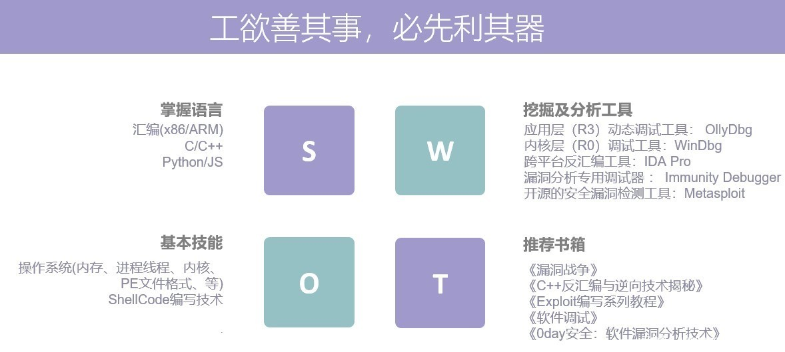

# 基础知识

折腾二进制安全，往往需要具备一定的`基础知识`，也称为`背景知识`。

二进制安全常涉及的知识有：

* 操作系统
  * 内存管理
  * 进程线程
  * 内核
* 文件格式
  * PE
* Shellcode编写技术
* 等

相关的一些书籍：

* 《漏洞战争》
* 《C++反汇编与逆向技术揭秘》
* 《Exploit编写系列教程》
* 《软件调试》
* 《0day：软件调试分析技术》

转个某人整理的，二进制安全相关基础知识的概览：

* 
