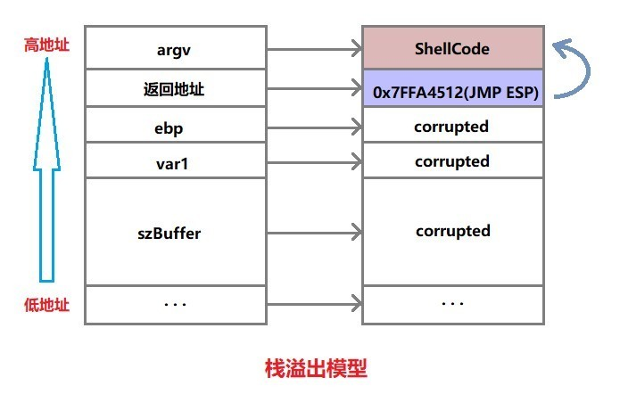
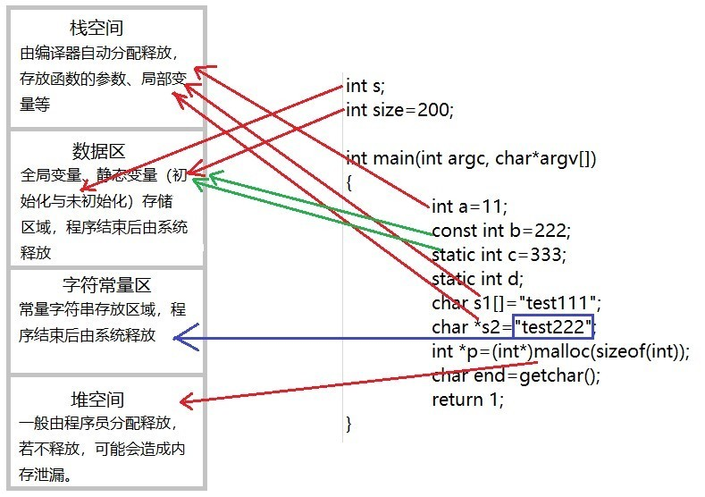

# 堆栈

* 堆栈
  * 是什么：堆栈都是一种数据项按序排序的数据结构
  * 特点：只能在一端（称为栈顶）对数据项进行插入和删除
    * 堆：队列优先，先进先出
    * 栈：先进后出
  * 功能：暂时存放数据和地址
  * 用途：通常用来保护断电和现场
  * 操作：堆栈中定义了一些操作
    * 两个最重要的是PUSH和POP
      * PUSH操作：在堆栈的顶部加入一个元素
      * POP操作：相反，在堆栈顶部移去一个元素，并将堆栈的大小减一

## 相关安全问题

* 数组越界访问
* 堆溢出
* 栈溢出
  * 

## 堆与栈的分配

