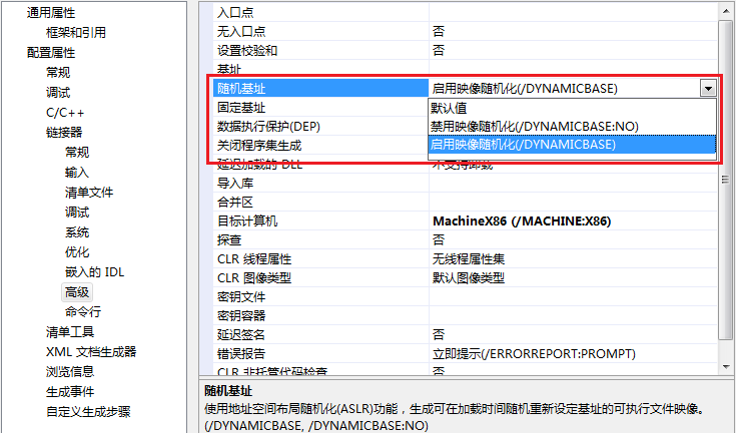
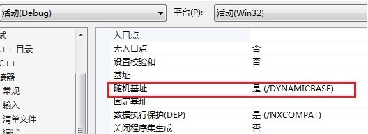

# ASLR

* `ASLR`
  * = `Address Space Layout Randomization`=`地址空间布局随机化`
  * 是什么：是一种针对缓冲区溢出的安全保护技术
  * 背景
    * 没有ASLR时
      * 每次进程执行，加载到内容中，代码所处堆栈stack的位置都是相同的
        * 容易被识别出所在位置
          * 容易被破解
  * 如果开启了`ASLR`=机制：
    * 操作系统加载器会针对基地址再去加上一个随机生成的偏移地址，然后再去加载程序模块
      * = 借助ASLR，PE文件每次加载到内存的起始地址都会随机变化
      * 通过对堆、栈、共享库映射等线性区布局的随机化
        * 增加攻击者预测目的地址的难度
          * 防止攻击者直接定位攻击代码位置，达到阻止溢出攻击的目的
  * 提示
    * （虚拟地址）此技术需要操作系统和软件相配合
  * 目的
    * 对付破解的一种有效的手段
    * 让程序被破解更加难
      * 破解程序一般指的是，运行`shellcode`
  * 系统支持ASLR的情况
    * `Linux`
      * `FreeBSD`
    * `Mac`
    * `Windows`
      * `PE`头文件中会设置`IMAGE_DLL_CHARACTERISTICS_DYNAMIC_BASE`标示来说明其支持`ASLR`
  * 如何开启
    * Windows
      * 语法：
        * 开启：`/DYNAMICBASE`
          * `Visual Studio`项目属性的配置
            * 
            * 
        * 关闭：`/DYNAMICBASE:NO`
  * 使用此技术后，杀死某程序后重新开启
    * `Linux`：地址会改变
    * `Windows`：地址不会改变，重启系统才会改变
  * ASLR主要影响几种部分
    * 模块随机化
    * 堆栈随机化
    * PEB/TEB随机化
* 相关
  * 目前大部分主流操作系统都已经实现了ASLR
    * `PIE` vs `ASLR`
      * `Linux`
        * `PIE`=`Position-Independent Execute`=`地址无关可执行文件`
          * 编译时
            * 将程序编译为位置无关
          * 地址随机化针对：代码段和数据段(`.data`段 `.bss`段)
        * ASLR：
          * 地址随机化针对：其他内存地址
      * `Linux`的`ASLR`+`PIE`作用 == `Window`下`ASLR`的作用

## 如何绕过ASLR

* 攻击未启用ASLR的模块
  * 虽然有映像随机化，但有可能进程中存在未启用ASLR的模块。 前面提到的`ROP`技术要求从一个固定的地址获取`Gadget`，如果进程中存在未启用`ASLR`的模块，那么就可以从那个模块获取`Gadget`了。 使用`OD`的`OllyFindAddr`插件可以快速找到进程空间中未启用ASLR的模块
* 堆喷射（`HeapSpray`）技术
  * 虽然有堆栈随机化，不过`HeapSpray`技术将`ShellCode`布局到`0x0C0C0C0C`（或者其他指定的地址上，通常这个地址要比较大），并不会受堆栈随机化的影响。 其实，`HeapSpray`中使用`ROP`绕过`DEP`的时候，就使用了前面提到的`攻击未启用ASLR的模块`。 只是，`HeapSpray`把`ShellCode`布局在堆上
* 覆盖部分返回地址
  * 映像随机化中，虽然模块的加载基地址发生变化，但是各模块的入口点地址的低位字不变，只有高位字进行了随机化处理。
  * 对于地址`0x12345678`，其中`5678`部分是固定的，如果存在缓冲区溢出，可以通过`memcpy`对后两个字节进行覆盖，可以将其设置为`0x12340000 ~ 0x1234FFFF`中的任意一个值。
  * 如果通过`strcpy`进行覆盖，因为`strcpy`会复制末尾的结束符`0x00`，那么可以将`0x12345678`覆盖为`0x12345600`，或者`0x12340001 ~ 0x123400FF`
  * 部分返回地址覆盖，可以使得覆盖后的地址相对于基地址的距离是固定的，可以从基地址附近找可以利用的跳转指令
  * 这种方法的通用性不是很强，因为覆盖返回地址时栈上的`Cookie`会被破坏。不过具体问题具体分析，为了绕过操作系统的安全保护机制需要考虑各种各样的情况
* Java Applet Spray
  * Java Applet中动态申请的内存空间具有可执行属性（PAGE_EXECUTE_READWRITE），类似HeapSpray技术，可以在固定的地址上分配滑板指令(如NOP)和ShellCode，然后跳转到那个地址上面去执行。 和常规的HeapSpray不同，Applet申请空间的上限为100MB，而常规的HeapSpray可以达到1GB
* JIT Spray
  * JIT (Just In Time Compilation) 即时编译，也就是解释器（比如Python解释器）。主要思想是将 ActionScript代码中进行大量的XOR操作。然后编译成字节码，并且多次更新到Flash VM中，这样它会建立很多带有恶意Xor操作的内存块
* Tombkeeper在CanSecWest 2013上提出的基于SharedUserData的方法
