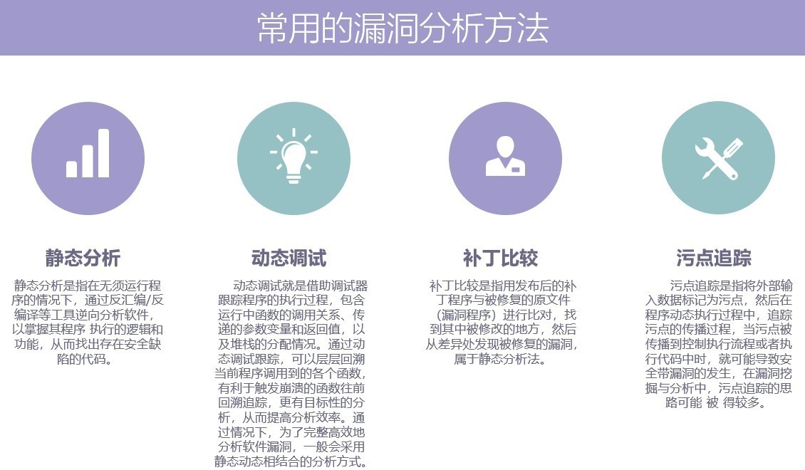

# Windows

此处介绍二进制安全在Windows方面的应用。

## Windows常用漏洞分析方法

* 静态分析
* 动态调试
* 补丁比较
* 污点追踪

概述：

## 软件逆向

* 软件逆向
  * =软件逆向工程
  * 定义
    * 通过反汇编和调试等手段，分析计算机程序的二进制可执行代码从而获得程序的算法细节和实现原理的技术。
  * 研究对象
    * 没有公开源代码的计算机程序
      * 主要是已经经过编译的二进制可执行代码
        * 举例
          * win32平台上
            * PE文件
              * 常见文件格式
                * exe
                * dll
  * 分类
    * 系统级逆向
      * 大范围分析观察，整体把握
    * 代码级逆向
      * 程序二进制码中提取设计理念和算法
  * 步骤
    * 研究保护方法，去除保护功能
      * 解码/反汇编（目标二进制代码）
    * 反汇编目标软件，定位功能函数
      * 中间语言翻译（汇编或类汇编代码）
    * 分析汇编代码
      * 数据流分析（各级中间语言）
    * 修改汇编代码或还原高级源代码
      * 其他分析和优化（高级抽象代码）
  * 工具
    * `Ollydbg`：动态追踪工具，插件较好较多
    * `Windbg`：用户态和内核态调试工具
    * `IDA`：交互式反汇编器
    * `PEID`：著名的查壳工具
    * `C32Asm`：反汇编程序，可直接修改软件内部代码，有十六进制编辑模式
  * 主要应用
    * 软件破解：破解软件的版权让用户不支付授权费用就可以使用软件的全部功能。
    * 病毒和恶意程序的分析：恶意程序的传播机制和危害并设计出解，分析病毒解决办法。
    * 系统漏洞分析：分析漏洞原理，设计补丁程序或者编写利用程序（Exploit）
    * 分析不公开的文件格式，协议等
    * 分析windows或mac平台上的硬件驱动程序编写linux下的相应驱动
    * 挖掘消费电子产品的潜能
    * 挖掘操作系统未文档化的API，发现更多内幕
    * 计算机犯罪取证
