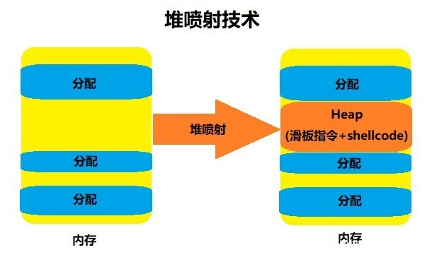

# Heap Spray

* `Heap spray`=`堆喷射技术`
  * 是什么：一种payload传递技术
    * 借助堆来将Shellcode放置在可预测的堆地址上，然后稳定地跳入Shellcode
  * 背景
    * 不论是基于栈溢出还是堆溢出的缓冲区漏洞攻击 ，在攻击者成功造成系统溢出后都必须考虑跳转地址（如函数返回点）的覆盖。在以往的攻击中，如何确定Shellcode在内存中位置，使得跳转地址被覆盖为Shellcode的起始地址是攻击者需要精确计算的。并且这往往也是攻击中最难以实现的部分。另外，考虑到一些外部环境因素比如操作系统版本的不同，使得溢出攻击变得更加难以实现
  * Heap spray技术大大缓解了这一问题
    * 起初，技术人员发现可以通过Javascript申请大量的堆内存来消耗资源，造成目标主机的瘫痪。但是并没有进一步利用。直到后来，SkyLined在2004年为IE的IFRAME漏洞所写的exploit中才第一次正式提出了Heap spray。
    * 之后经过不断发展，Heap spray逐渐成为网页挂马的常用技术，并且被利用到文档攻击中（如PDF阅读器）
  * 原理
    * 
