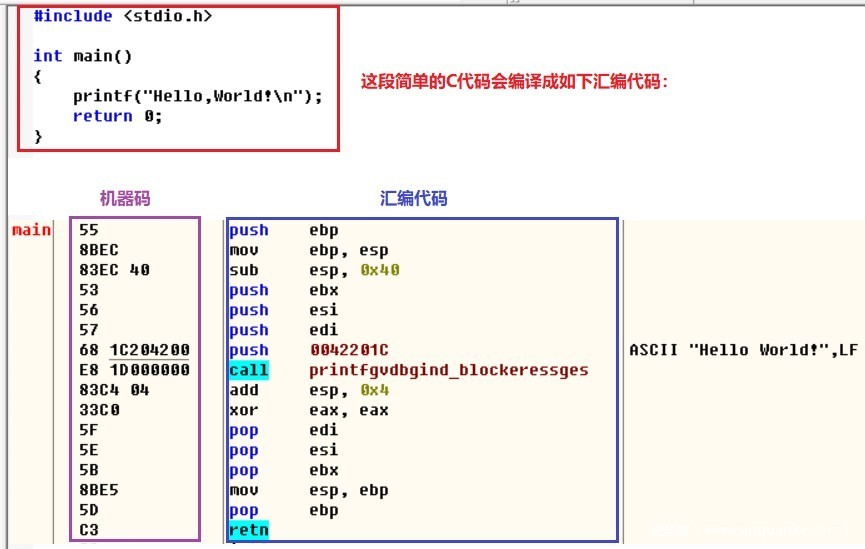
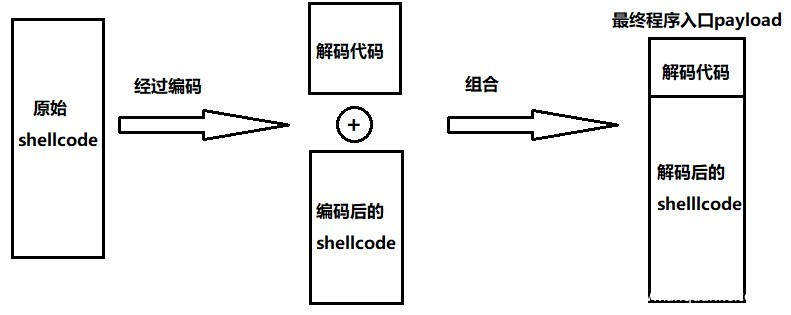
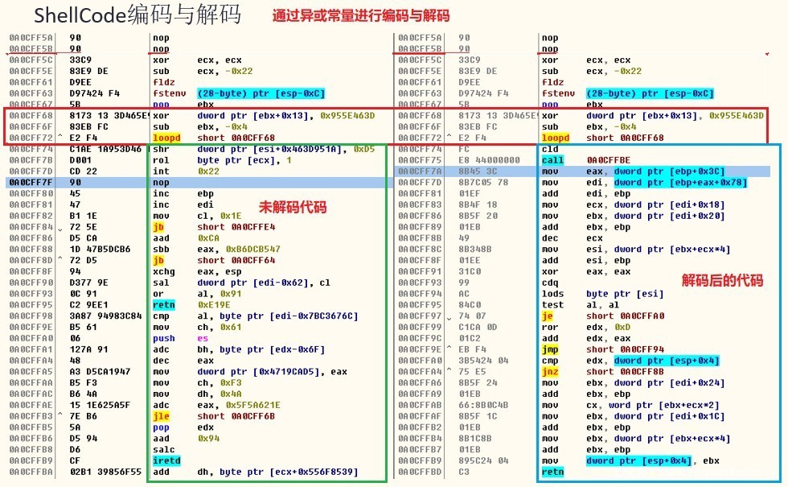

# Shellcode

* `Shellcode`=`脚本代码`
  * 是什么：Shellcode是一小段代码 = 载荷
  * 作用：实现利用软件漏洞
  * 名称由来：被称为`Shellcode`是因为它通常启动一个命令终端=shell
    * 攻击者可以通过这个终端控制受害的计算机
  * 常见形式：（用）机器码（编写shellcode）
  * 重点：要懂汇编
    * 举例
      * 
  * Shellcode编码与解码
    * 
    * 
