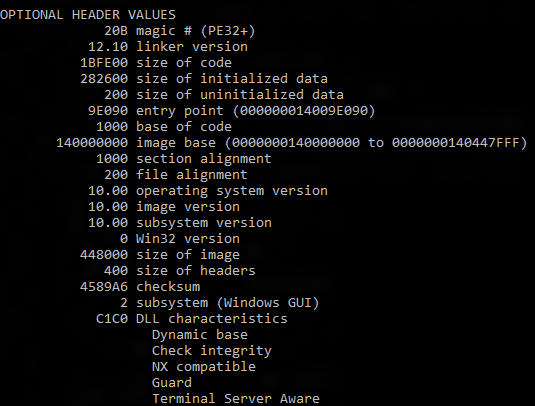

# CFG

* `CFG`
  * =`Control Flow Guard`=`控制流保护`
  * 是什么：一个高度优化的平台级的安全特性
  * 开启了CFG
    * 会告诉编译器，在编译期间，去分析代码的控制流，找到有哪些间接调用，并记录下来，用于分析编译出的二进制文件
    * Windows对于程序的每个间接调用都会做个检查
      * 如果检测发现不合法的，会抛出异常``RaiseFastFailException`
  * 细节
    * 通过对于一个程序可以从哪里开始运行加上严格的限制
      * 使得想要通过缓冲区溢出等漏洞去破解以执行任意代码的难度的大大增加
  * 支持情况
    * `Microsoft Visual Studio 2015`之后才支持
  * 如何开启
    * 编译器参数
      * 语法：`/guard:cf`
    * 界面设置
      * 
  * 如何确认一个程序支持了CFG？
    * 用`dumpbin`查看导出信息
      * `dumpbin /headers /loadconfig test.exe`
        * 输出中包含`Guard`
          * 
        * 加载配置中包含`CF Instrumented`和`FID table present`
          * 
