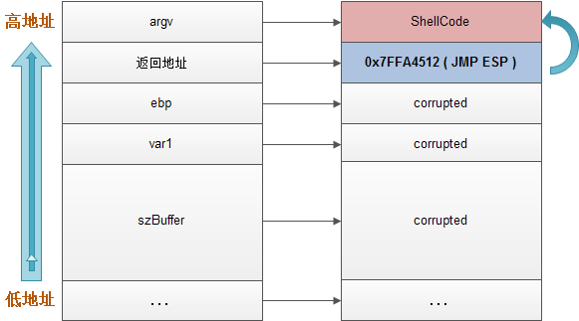
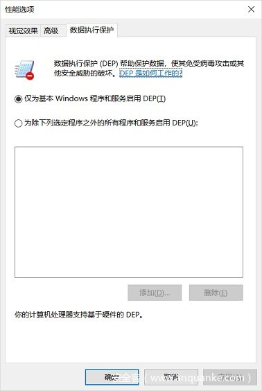
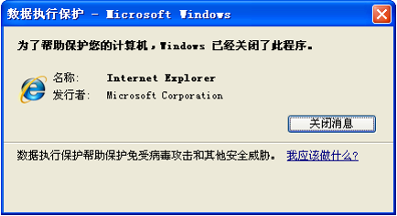

# DEP

* `DEP`
  * =`Data Execution Prevention`=`数据执行保护`
  * 背景
    * 早期操作系统没有区分数据和代码，`EIP`指向哪里就去哪里执行
      * 
    * -> 溢出攻击的根源在于现代计算机对数据和代码没有明确区分这一先天缺陷，就目前来看重新去设计计算机体系结构基本上是不可能的，我们只能靠向前兼容的修补来减少溢出带来的损害，DEP（数据执行保护，Data Execution Prevention）就是来弥补计算机对数据和代码混淆这一缺陷的
      * 微软从WinXP SP2开始提供这种技术支持
  * 含义：`堆`，`栈`上的内存页属性为不可执行，执行会出错
  * 目的：防止某些内存区块，比如栈，被执行
  * 如何开启
    * 语法：
      * 开启：`/NXCOMPAT`
      * 关闭：`/NXCOMPAT:NO`
    * 选项设置
      * 
  * 效果
    * 开启了DEP后，能帮助检测到异常情况：
      * 
    * 开启DEP前后的流程对比
      * 
  * 详解
    * `DEP`能够在内存上执行额外检查以帮助防止在系统上运行恶意代码
    * `DEP`是一套软硬件技术，能够在内存上执行额外检查以帮助防止在系统上运行恶意代码。在`Microsoft Windows XP Service Pack 2`及以上版本的`Windows`中，由硬件和软件一起强制实施`DEP`
    * 支持`DEP`的`CPU`利用一种叫做`No eXecute`=`不执行`的技术识别标记出来的区域。如果发现当前执行的代码没有明确标记为可执行（例如程序执行后由病毒溢出到代码执行区的那部分代码），则禁止其执行，那么利用溢出攻击的病毒或网络攻击就无法利用溢出进行破坏了。如果`CPU`不支持`DEP`，Windows 会以软件方式模拟出`DEP`的部分功能

* 相关
  * 如果同时开启了`DEP`和`ASLR`
    * 会让破解非常困难
      * 背景：一般用`shellcode`和`ROP`技术去破解
  * `ROP`
    * =`Return Oriented Programming`
      * 早期叫：`Ret2Libc`
      * 实现原理
        * `ROP`由一系列的`Gadget`组成
        * 所谓`ROP Gadget`，就是一系列以retn结尾的指令，所有的这些`Gadget`组合起来就能完成特定的任务
          * 比如调用`VirtualProtect`给指定的内存块添加可执行属性
  * 寄存器
    * `eip`
    * `esp`+`offset`
