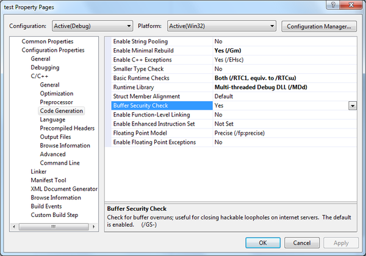
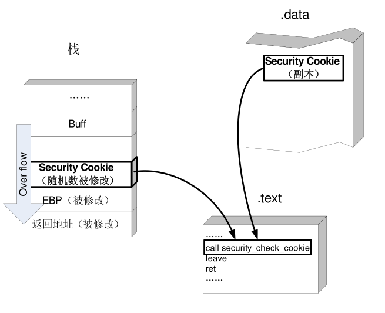
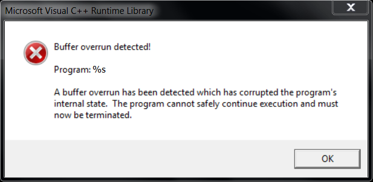
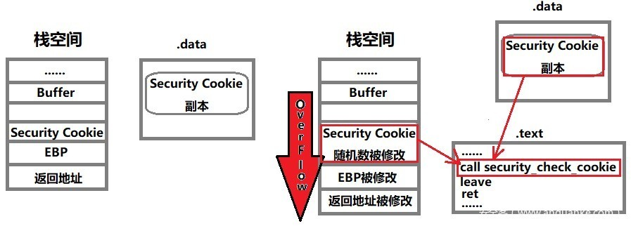

# GS

* `GS`
  * =`Buffer Security Check`=`缓冲区安全检查`
    * 别称：
      * `Stack cookie`
      * `Security Cookie`
        * `OD`、`IDA`中称为`Security Cookie`
      * `GS cookie protection`
      * `GS security protection`
  * 是什么：一个**编译器参数**
  * 功能和作用：用于缓存安全检查，检查缓存是否溢出
    * 决定编译器**是否生成**用于检测是否发生了缓冲区溢出`buffer overruns`的**代码**
  * 如何设置
    * Windows
      * IDE：`Visual Studio`
        * 编译器：`MSVC Compiler`
          * 编译器参数：`GS`
            * 如何配置：
              * 开启：`/GS`
                * VS安全编译选项中的GS
                  * 
              * 关闭：`/GS-`
        * 代码中配置
          * 文件级别
            * `strict_gs_check` pragma
              * 语法
                * `#pragma strict_gs_check( [ push, ] { on | off } )`
                * `#pragma strict_gs_check( pop )`
              * 举例：
                  ```c
                  // pragma_strict_gs_check.cpp
                  // compile with: /c

                  #pragma strict_gs_check(on)

                  void ** ReverseArray(void **pData,
                                      size_t cData)
                  {
                      // *** This buffer is subject to being overrun!! ***
                      void *pReversed[20];

                      // Reverse the array into a temporary buffer
                      for (size_t j = 0, i = cData; i ; --i, ++j)
                          // *** Possible buffer overrun!! ***
                              pReversed[j] = pData[i];

                      // Copy temporary buffer back into input/output buffer
                      for (size_t i = 0; i < cData ; ++i)
                          pData[i] = pReversed[i];

                      return pData;
                  }
                  ```
          * 函数级别
            * 作用：指定某个函数不需要安全缓存检查
            * 使用场景：你自己是个专家，会用手动做代码检查或者用其他手段确保代码很安全，无需检查
            * 语法：`__declspec(safebuffers)`
            * 举例：
              ```cpp
              // compile with: /c /GS
              typedef struct {
                  int x[20];
              } BUFFER;
              static int checkBuffers() {
                  BUFFER cb;
                  // Use the buffer...
                  return 0;
              };
              static __declspec(safebuffers)
                  int noCheckBuffers() {
                  BUFFER ncb;
                  // Use the buffer...
                  return 0;
              }
              int wmain() {
                  checkBuffers();
                  noCheckBuffers();
                  return 0;
              }
              ```
        * UI界面中配置
          * 
    * Intel
      * 编译器：`Intel C++ Compiler`
        * 参数
          * `Windows`：
            * 语法：`/GS[:keyword]`
              * `keyword`：GS的`level`
                * `off`->`/GS[:off]`：忽略，关闭GS
                  * =`/GS-`
                * `partial`->`/GS[:partial]`：用`Microsoft Visual Studio 2008`的标准=level
                * `strong`->`/GS[:strong]`：提供完整的安全检查，兼容最新版`Microsoft Visual Studio`的标准
                  * =`/GS`
          * `Linnux`/`macOS`
            * 开启：`-fstack-security-check`
            * 关闭：`-fno-stack-security-check`
  * 实现原理
    * 图解
      * 
    * 文字解释
      * 内部是利用`GS缓存区`=`GS Buffers`实现缓冲区溢出的检测
      * 其在编译器检测到的易受缓冲区溢出攻击的函数中创建`security cookie`
        * 如果攻击者写的代码，超过缓冲区长度，覆盖了`返回地址`、`异常处理程序的地址`、`易受攻击的函数参数`，则运行时(runtime)会覆盖`security cookie`。
          * 运行时会在允许执行代码跳转到此地址或返回这些函数参数之前，检测`cookie`的完整性，以避免攻击
  * 使用效果
    * 运行时如果发生缓存区溢出会报错
      * 

## 如何绕开GS

* 利用未被保护的内存
  * 系统为了将GS对性能的影响降到最小, 并不是所有的函数都会保护. 例如, 一个函数中不包含4字节以上的缓冲区时, 即使GS处于开启状态, 这个函数也是不受保护的. 因此, 可以针对这类函数, 构造巧妙的shellcode进行溢出
* 通过猜测cookies值
  * GS保护机制采用了几个较弱的熵源，攻击者可以对其进行计算并使用计算结果来预测cookie值，但是这种犯法只适用于针对本地系统的攻击（攻击者拥有该机器的访问权限）
    * 论文链接
      * http://uninformed.org/?v=7&a=2&t=pdf
* 覆盖虚函数(指针)
  * 程序只有在函数返回时, 才会去检查`Security Cookie`，而我们在程序检查`Security Cookie`之前劫持程序流程的话，就可以实现对程序的溢出。例如使用`C++`的虚函数溢出即可实现上述功能
    * 校验Security Cookie
      * 
* 攻击异常处理
  * GS机制没有对`SEH`提供保护, 因此可以通过攻击程序的异常处理机制达到绕过GS的目的. 通过构造超长的字符串覆盖掉异常处理指针, 然后触发一个异常, 程序就会转入异常处理; 由于异常处理指针已被覆盖, 因此可以通过劫持SEH来控制程序的后续流程.
* 同时替换栈和`.data`中的`Cookie`
  * 若要在`Security Cookie`正常工作的情况下实现绕过, 由于`Cookie`具有很强的随机性, 难以猜测, 所以只能同时替换栈和`.data`中的`Cookie`实现绕过. 构造特殊的`shellcode`使用相同的值覆盖栈和`.data`中的`Cookie`, 即可实现GS绕过.

## 相关知识

### gcc编译器参数：`fstack-protector`

* gcc通用编译参数
  * `fstack-protector`
    * 功能：开启或关闭某些或所有函数的栈溢出的安全检查
    * 语法
      * `Linux`/`macOS`
        * 语法
          * 开启：`-fstack-protector[-keyword]`
          * 关闭：`-fno-stack-protector[-keyword]`
        * 解释
          * `keyword`
            * `strong` -> `-fstack-protector-strong`：任何类型的缓存(any type of buffer)都进行栈的溢出的安全检查
            * `all`->`-fstack-protector-all`：每个函数(every routine)都进行安全检查
            * 无参数->`-fstack-protector`：对于每个字符串缓存(string buffer)的栈溢出进行安全检查
    * 内部实现
      * 优先用`gcc/glibc`的实现
        * 如果没有，其次用`Intel`的实现
          * 等价于`-fstack-security-check`
