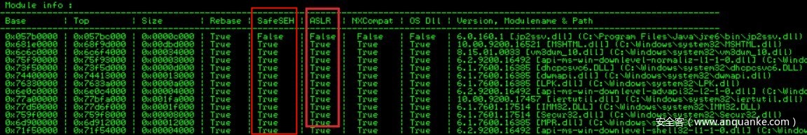

# SafeSEH

* `SafeSEH`
  * =`Safe Exception Handlers`
  * 作用：异常处理保护
    * 如果开启了`SafeSEH`，那么编译器只会生成一个镜像，其`安全异常处理程序`的`静态表`
      * 用于告诉操作系统，此镜像文件的异常处理程序在哪
  * 目的：避免了攻击者重写异常处理程序的控制流程
  * 语法
    * 开启：`/SAFESEH`
    * 关闭：`/SAFESEH:NO`
  * 详解
    * 在Win XP SP2及后续版本的系统中，微软引入了著名的S.E.H校验机制SafeSEH。原理很简单，在程序员调用异常处理函数前，对要调用的异常处理函数进行一系列的有效性校验，当发现异常处理函数不可靠时将终止异常处理函数的调用。 SafeSEH实现需要操作系统与编译器的双重支持，二者缺一都会降低SafeSEH的保护能力。在VS2003及后续版本中默认启用。
  * 注：
    * 只支持：`x86`平台
    * 不支持：那些已经标注了异常处理程序的平台
      * 举例
        * `x64`
          * 相关工具
            * `ml64.exe`= `x64`的`Microsoft Assembler`
              * 支持给程序生成`SEH`信息(`XDATA`和`PDATA`)信息
        * `ARM`
      * 这些平台：异常处理程序都已被放到了固定的`PDATA`
  * 举例
    * 
