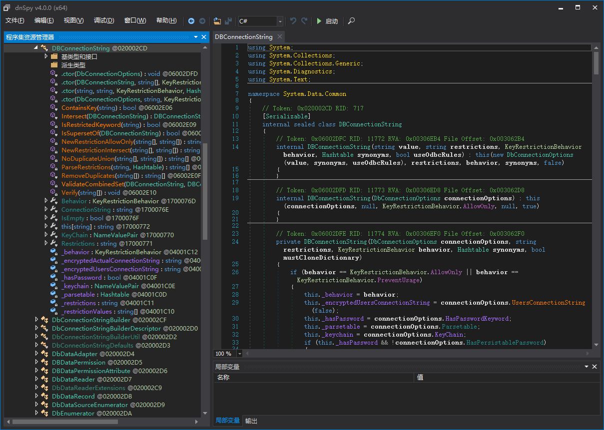

# dnSpy

* `dnSpy`
  * 一句话描述：a debugger and .NET assembly editor
  * 特点：无需源码也能修改`.NET`程序
  * 功能
    * 功能组件
      * 编译器
      * 调试器
      * 汇编编辑器
    * 支持编写插件扩展功能
  * 截图
    * 
  * 资料
    * Github
      * 0xd4d/dnSpy: .NET debugger and assembly editor
        * https://github.com/0xd4d/dnSpy
