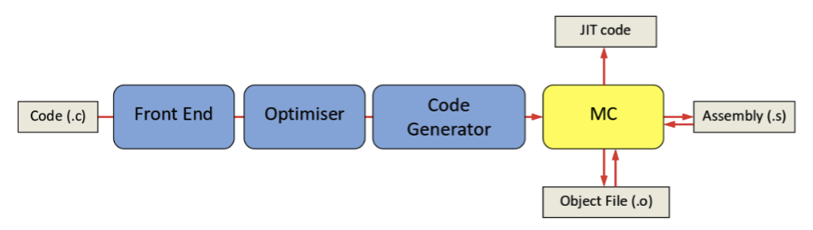
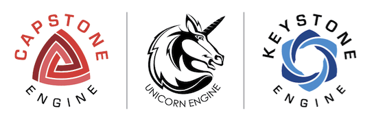
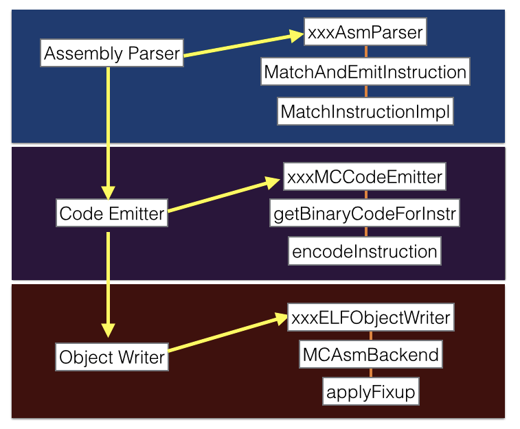
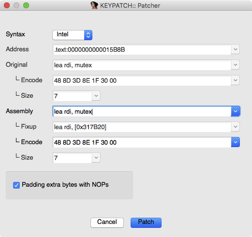
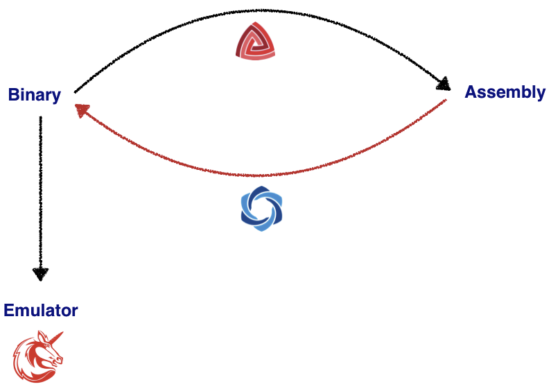
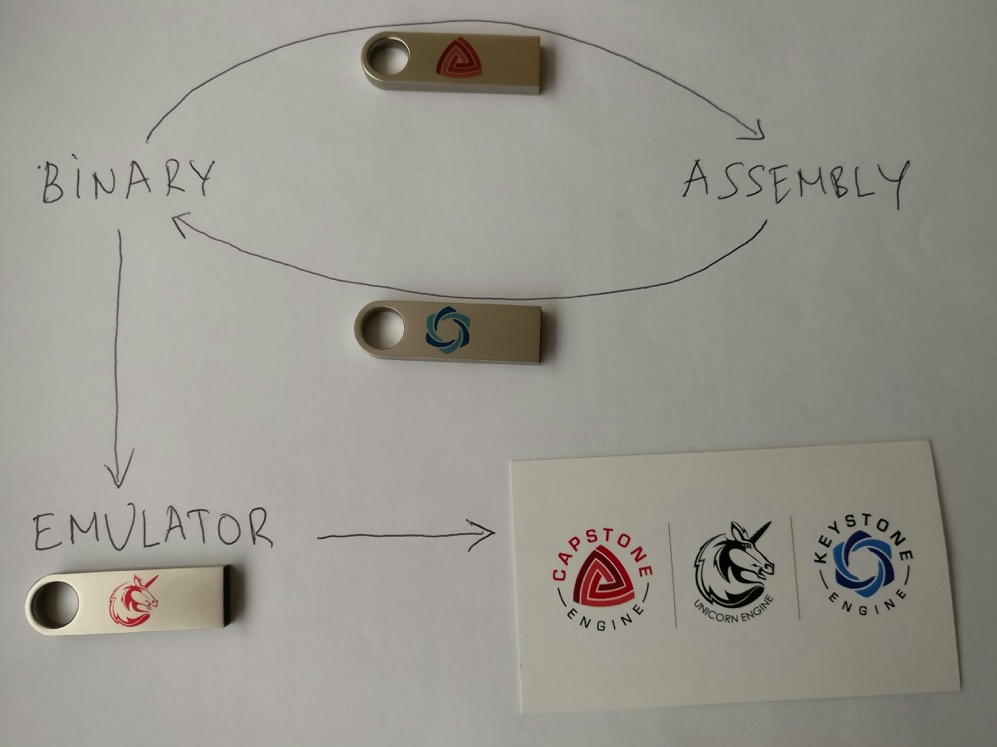

# Capstone

* Capstone
  * 一句话描述：
    * a lightweight multi-platform, multi-architecture disassembly framework
      * 一个轻量级的支持多平台和多架构的反汇编框架
  * 特点：
    * lightweight 轻量级
      * 简洁的API
        * Clean/simple/lightweight/intuitive architecture-neutral API
        * 多种语言接口Bindings
          * Python, Ruby, Go, NodeJS等
    * multi-platform 支持多平台
      * `Windows` & `*nix` (with `Mac macOS`, `iOS`, `Android`, `Linux`, `*BSD` & `Solaris` confirmed)
    * multi-architecture 支持多种架构
      * `Arm`, `Arm64` (`Armv8`), `BPF`, `Ethereum Virtual Machine`, `M68K`, `M680X`, `Mips`, `MOS65XX`, `PowerPC`, `RISCV`, `Sparc`, `SystemZ`, `TMS320C64X`, `Web Assembly`, `XCore` & `X86` (include `X86_64`)
  * 用途=应用领域
    * 安全领域
      * 二进制分析 binary analysis
      * 逆向 reversing
  * 号称
    * Next Generation Disassembler Engine
    * 更好的下一代反汇编引擎
  * 特别说明
    * 著名的开源逆向工具`Radare2`以及商业逆向工具`IDA Pro`的三方插件都基于`Capstone`
  * 主页
    * 官网
      * The Ultimate Disassembly Framework – Capstone – The Ultimate Disassembler
        * http://www.capstone-engine.org
    * GitHub
      * aquynh/capstone: Capstone disassembly/disassembler framework: Core (Arm, Arm64, BPF, EVM, M68K, M680X, MOS65xx, Mips, PPC, RISCV, Sparc, SystemZ, TMS320C64x, Web Assembly, X86, X86_64, XCore) + bindings.
        * https://github.com/aquynh/capstone

## Capstone vs llvm

* capstone源自`LLVM`编译器框架中的**MC模块**
  * `MC`模块中有个反汇编引擎叫做`MCDisassembler`
    * `MC`=`Machine Code`
    * 机制：
      * 
  * 而`llvm`甚至还有个工具叫做：`llvm-mc`
    * 可以用于反汇编输入的二进制文件
* `capstone`才用了`MCDisassembler`作为核心内容
  * 但又经过了大量优化改动，以适配自己的设计
  * `capstone`在`MCDisassembler`在基础上加了其他的大量的功能
    * ->`MCDisassembler`能做的`capstone`都能做
* `capstone`和`llvm-mc`的区别
  * 详见
    * https://www.capstone-engine.org/beyond_llvm.html

## 其他相关

* capstone转llvm
  * chubbymaggie/capstone2llvmir: Library for Capstone instruction to LLVM IR translation
    * https://github.com/chubbymaggie/capstone2llvmir
* 成套工具
  * 3件套
    * Logo
        * 
    * 3个项目
      * `Capstone disassembler`
        * Next Generation Disassembler Engine
          * http://capstone-engine.org
      * `Unicorn emulator`
        * Next Generation CPU Emulator
          * http://unicorn-engine.org
      * `Keystone assembler`
        * http://keystone-engine.org
        * 流程
          * 
        * IDA插件
          * Keypatch – Keystone – The Ultimate Assembler
            * https://www.keystone-engine.org/keypatch/
              * 
        * 竞品
          * `Radare2`
            * Unix-like reverse engineering framework and commandline tools
          * `Pwnypack`
            * CTF toolkit with Shellcode generator Ropper: Rop gadget and binary information tool
          * `GEF`
            * GDB plugin with enhanced features
          * `Usercorn`
            * Versatile kernel+system+userspace emulator
          * `X64dbg`
            * An open-source x64/x32 debugger for windows
          * `Liberation`
            * code injection library for iOS
          * `Demovfuscator`
            * Deobfuscator for movfuscated binaries
    * 效果：
      * Fundamental frameworks for Reverse Engineering
      * 
      * 
