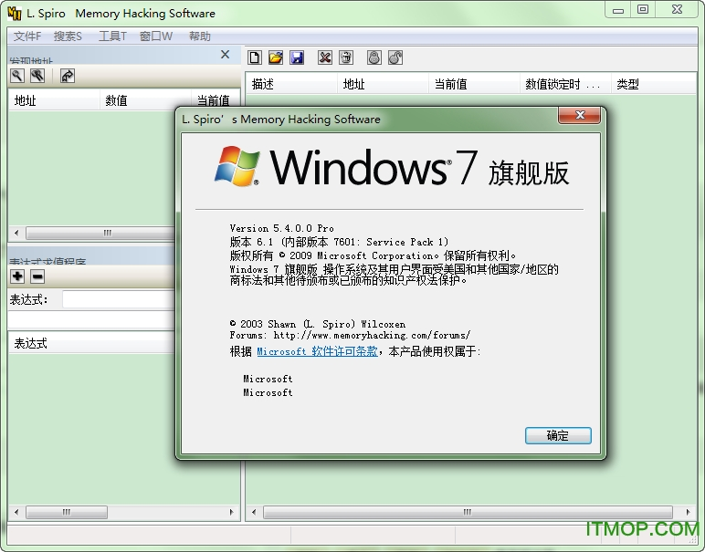

# MHS

* `MHS`
  * =`Memory Hacking Software`
  * 截图
    * 
  * 主要功能
    * Searching
    * View RAM In Real-Time
    * Debugging
    * Disassembling
    * Inject Code
    * Inject DLL’s
    * Scripting
    * Hotkeys
    * Real-Time Expression Evaluator
  * 资料
    * 官网
      * L. Spiro's Memory Hacking Software
        * http://memoryhacking.com
      * 下载
        * http://memoryhacking.com/download.php
