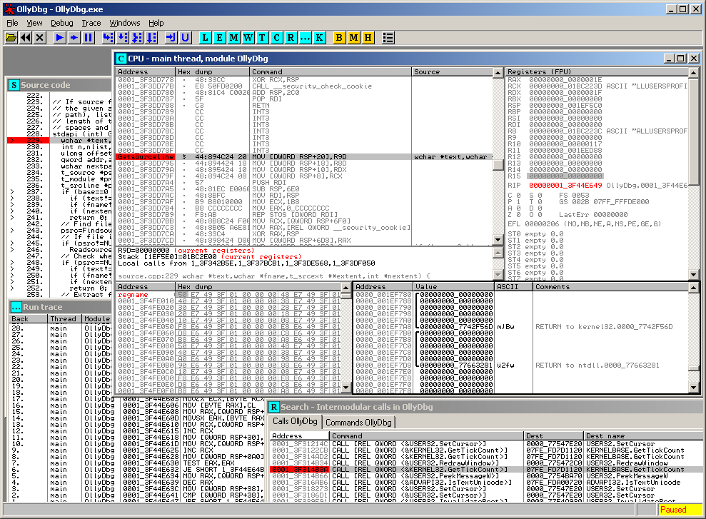

# Ollydbg

TODO:

* 在看雪上有人翻译了国外人写的<使用ollydbg从零开始cracking>，还是挺详细的介绍了od的使用，推荐阅读和动手跟一遍。
  * 使用OllyDbg从零开始Cracking(已完结)-『外文翻译』-看雪安全论坛
    * https://bbs.pediy.com/thread-184679.htm

------

* `Ollydbg`
  * 一句话描述：OllyDbg is a `32-bit`=`x86` assembler level analysing debugger for Microsoft® Windows®. Emphasis on binary code analysis makes it particularly useful in cases where source is unavailable
  * 功能和特点
    * It traces registers, recognizes procedures, API calls, switches, tables, constants and strings, as well as locates routines from object files and libraries.
    * It has a user friendly interface, and its functionality can be extended by third-party plugins
  * 名字
    * `Olly`来源于作者：`Oleh Yuschuk`
  * 评价
    * OllyDbg是windows平台下Ring 3级调试器
    * 界面友好
    * 非常容易上手
    * 支持插件扩展功能
    * 是当今最流行最强大的动态调试工具
  * 截图
    * 
  * 应用举例
    * 游戏破解
      * 目前做辅助的基本均用此调试器分析需要的资源结构、内存数据、功能函数用于开发辅助功能
  * 资料
    * 官网
      * v1
        * OllyDbg v1.10
          * http://www.ollydbg.de
      * v2
        * OllyDbg 2.0
          * http://www.ollydbg.de/version2.html

